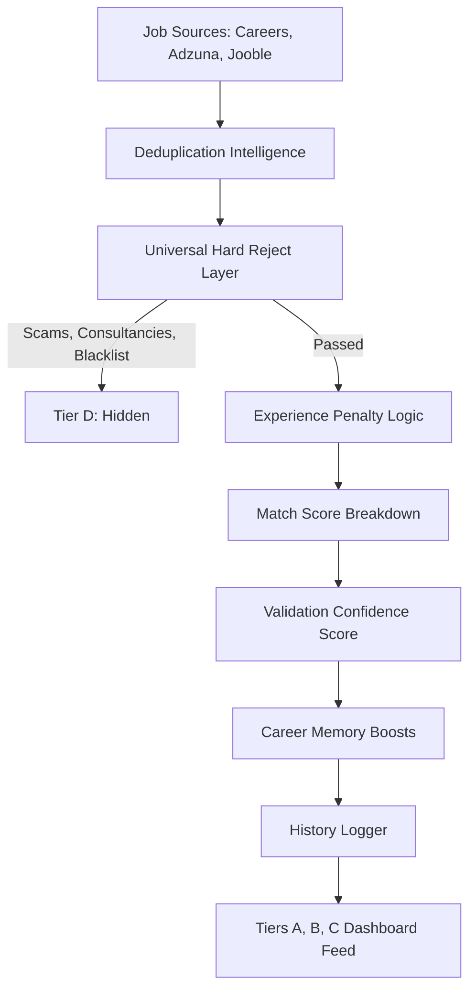

# Airohunt AI — Career Discovery Engine (v1)

Airohunt is a profile-driven, strict-filtering job discovery and application tracking assistant. Rather than maximizing the volume of applications, Airohunt filters out noise (scams, course sellers, duplicate listings) to surface high-quality opportunities matching the candidate's exact profile.

```text
Find fewer jobs  ➔  Find better jobs  ➔  Get more interviews
```

---

## 🛠️ Key Features

- **Strict Validation Engine (v1)**: Validates, scores, and classifies jobs into Tiers A, B, C, and D based on the candidate's preferences, rules, and skills.
- **Experience Penalty System**: Integrates entry-level thresholds. Mismatches above target experience levels are penalized (e.g., -15 pts for +1 year, -30 pts for +2/3 years) instead of immediately hard-rejected, mimicking realistic startup hiring practices.
- **Deduplication Intelligence**: Automatically merges identical postings from different sources, prioritizing high-trust direct URLs (Direct Careers > Greenhouse/Lever > Ashby/Workable) over third-party aggregators (Jooble, Adzuna).
- **Validation Confidence Score**: Calculates listing credibility (completeness, description details, salary visibility) on a 0-100 scale.
- **On-the-Fly Resume Tailoring**: Employs LLM integration to adapt specialized resume profiles to matches before application.
- **Console Auto-Fill Helper**: Injects custom autofill scripts to help populate application forms on Greenhouse, Lever, etc.

---

## 🏗️ System Architecture & Quality Pipeline



---

## ⚙️ Tech Stack

- **Backend**: FastAPI (Python 3.12+), Uvicorn, Pydantic, standard AI integrations.
- **Frontend**: React (v18), Zustand (State), React Flow (Pipeline Workflow Canvas), TailwindCSS.

---

## 🚀 Getting Started

### 1. Run the Backend Server
Prerequisites: Python 3.12+ installed.
```bash
cd backend
python -m uvicorn main:app --reload --port 8000
```
The API docs will be active at [http://localhost:8000/docs](http://localhost:8000/docs).

### 2. Run the Frontend App
Prerequisites: Node.js (v18+) and npm installed.
```bash
cd frontend
npm install
npm start
```
The application dashboard will open at [http://localhost:3000](http://localhost:3000).

---

## 🔬 Running Verification Tests

Run the backend validation rules verification test script:
```bash
cd backend
python test_strict_validator.py
```
This tests:
1. Experience penalty tiers and score deductions.
2. Hard rejections (training institutes, scams, blacklists).
3. Deduplication prioritizations.

---

## 📈 Quality Metrics Modal
Open the **Validation Report** modal inside the Listings Pool sidebar to view:
- **Total Scraped** count vs **Displayed** (A/B/C) vs **Hard Rejected** (D).
- Categorized block reasons (scams, course sellers, experience limits).
- Historical experiment runs logs detailing past validation events.
